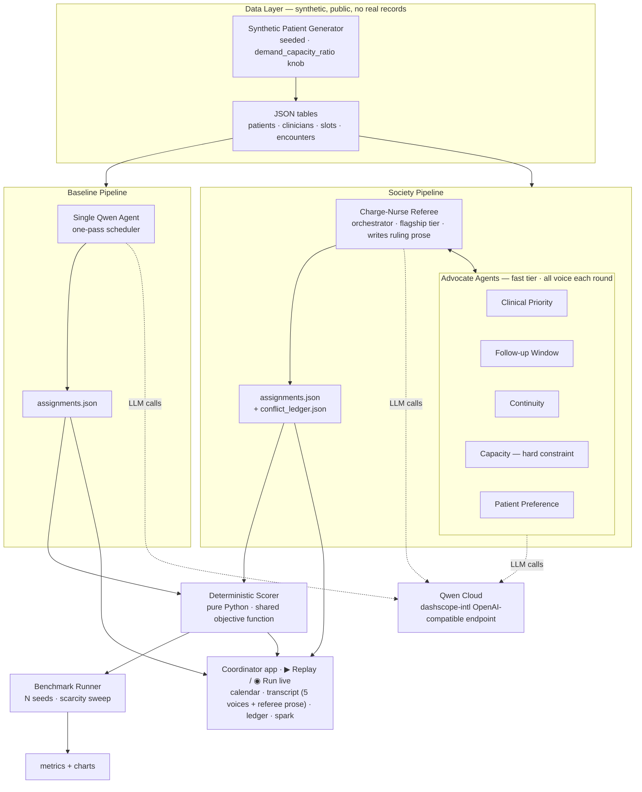
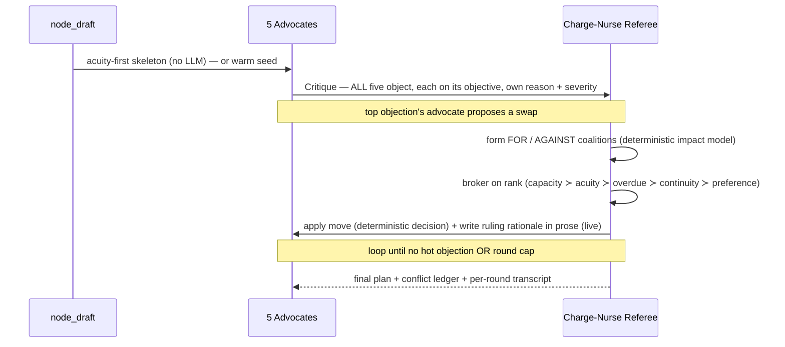

# RehabPanel — Design Document

**Project:** RehabPanel — a multi-agent rehab patient-panel scheduler
**Hackathon:** Global AI Hackathon Series with Qwen Cloud · **Track 3: Agent Society**
**Status:** Proposed · **Date:** 2026-06-10
**Submission deadline:** 2026-07-09 14:00 PDT

---

## 1. Context & Goals

### The real-world problem
Rehab nurses manage a panel (caseload) of patients and must decide, each cycle, **which patients to follow up, when, and in what mode** (clinic / tele / home), under a fixed amount of clinician time. Clinical urgency, follow-up-due dates, appointment capacity, continuity of care, and patient preference all compete for the same scarce slots. When demand exceeds capacity — the normal state — something must give.

### Why this is a *society* problem, not a big-task problem
A single agent told to "schedule the week" tends to **collapse the trade-off prematurely**: it anchors on the most legible objective (acuity), fills slots greedily, and lets merely-due-soon patients and continuity quietly rot. A system of agents *forced to negotiate* surfaces the conflict explicitly and lands a more balanced, higher-value plan. The measurable gain is therefore not "faster" but **"a more valuable outcome on a multi-objective score that a single agent cannot reach,"** and that gain *widens as scarcity increases*. The conflict is the point.

### Goals
1. Demonstrate task decomposition, role assignment, dialogue, and negotiation across distinct agents (Track 3 clause 1 & 2).
2. Produce a **reproducible, deterministic** efficiency gain over a single-agent baseline (Track 3 clause 3).
3. Run entirely on Qwen models via Qwen Cloud, on synthetic public data, with a watchable 3-minute demo.

### Non-goals / explicit boundaries
- **Not** autonomous clinical scheduling. RehabPanel is **decision support**: it proposes a plan with visible reasoning; a human approves. No clinical-safety claim is made.
- **No real patient data, ever.** All data is synthetic and generated by code in this repo (see §5). This is a privacy requirement *and* a benchmark-reproducibility advantage.
- Multi-agent is explicitly **overkill for low-scarcity cases**; the system targets the conflict-heavy regime. Stating this boundary is deliberate — it makes the measured gain credible rather than hype.

---

## 2. High-Level Design

Two pipelines consume the *same seeded dataset* and produce schedules scored by the *same deterministic function*:

- **Baseline** — one Qwen agent, single pass, produces a schedule.
- **Society** — five advocate agents + a referee negotiate a schedule and emit a conflict ledger.

A pure-Python scorer evaluates both; a benchmark runner repeats across seeds and a scarcity sweep (dev/CI reference); the coordinator app renders the calendar, the live negotiation transcript (all five advocates + the referee's prose ruling), and the society-vs-single-agent comparison.



---

## 3. Agents

Five advocates each score a candidate schedule through one lens; a referee runs the negotiation and breaks deadlocks.

| Agent | Optimizes for | Penalty it raises |
|-------|---------------|-------------------|
| **Clinical Priority** | High-acuity / deterioration-risk patients seen this cycle | Any patient above an acuity threshold left unscheduled |
| **Follow-up Window** | Each patient seen by their due-by date | Days overdue, accrued per patient |
| **Continuity** | Patient stays with primary clinician | Continuity breaks |
| **Capacity** | Hard feasibility — slots, clinic hours, home-visit travel, max/day | Can **reject** a plan as infeasible (veto) |
| **Patient Preference** | Availability windows + preferred mode | Preference mismatches |
| **Charge-Nurse Referee** *(orchestrator)* | Global weighted value; resolves deadlocks; logs rationale | — |

**Distinct-capabilities story under a Qwen-only constraint:** since every agent runs on Qwen Cloud, differentiation comes from (a) **role/prompt**, (b) **tool access**, and (c) **model tier** — the referee runs on a flagship Qwen tier, advocates on a fast/cheap tier. This is both a legitimate capability distinction *and* the primary defense against the limited token budget. (Exact model ids are env-overridable and never surfaced in the UI, since the catalog shifts.)

---

## 4. Negotiation & Conflict-Resolution Protocol

A **Draft → Critique → Negotiate → Arbitrate** loop:



1. **Draft** — a **deterministic acuity-first fill** (sickest first into free slots); no LLM — a feasible starting skeleton is a trivial sort+fill, so ≈ the single-agent score. Warm re-plan carries the current plan over and repairs only what an incident broke.
2. **Critique** — all **five advocates run concurrently**, each filing objections on its one objective with a 1–10 severity (live: one Qwen call per advocate, cached caseload prefix; e.g. *"P0014 is 6 days overdue and unscheduled — severity 8"*).
3. **Negotiate** — the single highest-severity objection sets the agenda: its advocate **proposes** a feasible swap, then a **deterministic impact model** groups the other advocates into **FOR / AGAINST** coalitions (whose objective the move improves / worsens).
4. **Arbitrate** — the referee brokers on the global priority **ranking** (capacity ≻ acuity ≻ overdue ≻ continuity ≻ preference; capacity = absolute veto), approving iff FOR outranks AGAINST — so it can **reject**, not just rubber-stamp. The **decision is deterministic** (reproducible); live, the flagship referee also **writes the ruling rationale in prose**. Every ruling appends a line to the **conflict ledger**.
5. Loop until no objection exceeds threshold or a round cap is hit. Output: final schedule + **conflict ledger**.

Every round's transcript shows **all five advocates' objections** (each its own reason) → the winner's proposal → FOR/AGAINST coalition → the referee's prose ruling. The conflict ledger is the demo centerpiece — a single agent never shows this work:
> *Tue 10:00 — Priority wants P0014 (acuity 8); Continuity wants P0009 (primary-nurse match). Referee: P0014, acuity outweighs continuity at current weights. P0009 → Thu 14:00.*

---

## 5. Data Flow & Schema

Five synthetic JSON tables (full schema in `rehabpanel/schema.py` and the generator). Output of both pipelines is `assignments.json`; the society additionally emits `conflict_ledger.json`.

```
Generator(seed, demand_capacity_ratio)
   → patients.json, clinicians.json, slots.json, encounters.json
       → Baseline  → assignments_baseline.json ─┐
       → Society   → assignments_society.json,  ├─→ Scorer → metrics.json → Benchmark → charts
                     conflict_ledger.json ──────┘
```

The single most persuasive figure: sweep `demand_capacity_ratio` from 0.8 → 1.6 and chart the society-vs-baseline value gap **growing** with scarcity.

---

## 6. Key Decisions & Trade-offs (ADRs)

### ADR-1: Deterministic Python scorer, not an LLM judge
**Decision:** score both pipelines with a pure-Python objective function.
**Why:** an LLM judge is non-reproducible and biasable; judges can re-run a Python scorer and get identical numbers. Reproducibility is the single biggest differentiator over typical hackathon entries.
**Consequence:** the objective weights must be defined and defensible (sourced from domain input). Harder: encoding "clinical value" numerically — mitigated by treating weights as configurable and reporting sensitivity.

### ADR-2: Synthetic data generated in-repo, no real/anonymized records
**Decision:** ship a seeded generator; never ingest real data.
**Why:** the submission repo must be public + open-source; real clinical data is a privacy/IP breach and likely violates a workplace policy. Synthetic data also makes the benchmark reproducible.
**Consequence:** domain realism must be engineered into the generator (distributions, overdue spread, shared-clinician clustering) rather than observed.

### ADR-3: Differentiate agents by role + tool + model tier, not by vendor
**Decision:** all agents on Qwen Cloud; capability distinction via prompt, tools, and Qwen model size.
**Why:** Qwen-only is a hard rule; tier-splitting also caps token cost (referee = expensive, advocates = cheap).
**Consequence:** must verify the "distinct capabilities" clause is satisfied by behavior, not just labels — advocates must demonstrably argue from different objectives.

### ADR-4: New build, not a port of prior agent work
**Decision:** build RehabPanel fresh for the submission window.
**Why:** the "significantly updated, and explain how" rule penalizes thinly-reskinned prior projects; a fresh, domain-specific concept carries no novelty burden.
**Consequence:** more build effort, but a clean eligibility story.

### ADR-5: OpenAI SDK against the dashscope-intl endpoint
**Decision:** use the OpenAI Python SDK pointed at `https://dashscope-intl.aliyuncs.com/compatible-mode/v1`.
**Why:** the endpoint is OpenAI-compatible, minimizing porting effort; the file configuring this client is the linkable **Alibaba Cloud proof-of-deployment** artifact required by the rules.
**Consequence:** keep that client-config file clean and obvious for judges.

---

## 7. How it maps to the judging rubric

- **Technical Depth & Engineering (30%)** — staged negotiation protocol, deterministic scorer, seeded reproducible benchmark, scarcity sweep, model-tiering.
- **Innovation & AI Creativity (30%)** — advocate/referee society with a conflict ledger; objective-driven negotiation rather than voting.
- **Problem Value & Impact (25%)** — a real, conflict-heavy clinical-ops pain point, validated by a domain expert, framed as safe decision support.
- **Presentation & Documentation (15%)** — live-negotiation demo (real Qwen) + this design doc + one-command run.

---

## 8. Risks & Mitigations

| Risk | Mitigation |
|------|------------|
| No measurable gap (society ≈ baseline) | Tune `demand_capacity_ratio > 1`; the gap *is* the result — verify early on day-1 smoke test |
| Token budget ($40 voucher) blown | Advocates on cheap Qwen tier; short structured messages; cap negotiation rounds |
| Negotiation loops / non-termination | Hard round cap + objection-severity threshold to exit |
| "It's just an ensemble" critique | Advocates argue from *distinct objectives* with marginal-value trades, not majority vote |
| Eligibility (proprietary data / novelty) | Synthetic-only data; fresh build; explicit "what's new" paragraph |

---

## 9. Evolution — the coordinator app (post-MVP)

The batch pipeline above (baseline vs society + benchmark) stays the reproducible
core. On top of it, we built a **coordinator app** so the society is *operated*,
not just measured. Full spec: `spec_coordinator_app.md`; architecture:
`architecture_app.svg`.

- **Framing.** The agent society **assists a nurse coordinator**: the coordinator
  sets roster, caseload and the priority rule; the society negotiates and shows
  its work; the coordinator reviews the conflict ledger and approves.
- **Incident-driven re-planning.** A nurse calls in sick, a patient cancels, or
  an urgent referral arrives → the live score drops → **Re-plan** runs a *warm*
  negotiation that repairs only what broke.
- **Two measurable gains.** (1) Initial-plan value vs the single-agent baseline —
  the headline, widening with scarcity. (2) After a disruption, **minimal
  disruption**: the society warm-repairs changing few appointments where a cold
  single agent would churn the whole week. Disruption is a diff reported *outside*
  the locked scorer (we don't claim a raw-value win on re-plan).
- **Legible negotiation.** Each round the transcript shows **all five advocates'
  objections** (their own reasons), the winner's proposal, the FOR/AGAINST
  coalition, and the referee's ruling — written **in prose by the flagship model**
  (live); the decision itself stays deterministic and reproducible.
- **Two entry points, no offline result shown.** **▶ Replay** plays a bundled
  recording of a *real* Qwen negotiation (key-free — the default view); **◉ Run
  live (Qwen)** streams a fresh one round by round. The UI never shows a
  deterministic-engine score or a model id.
- **Causal priority weights.** The Rules view changes both the score and the
  agents' priorities — offline, advocate severities scale by weight; online, the
  weights go into the prompts.
- **Stack.** FastAPI backend over an in-memory session behind a `Store` interface
  (a DB slots in later); a 5-view SPA (Caseload · Team · Rules ·
  Schedule/Negotiation · KPIs). Deploy: `deploy.md` (Config A — `OFFLINE=1` + key).
- **Scorer unchanged** — still pure-Python, external, and CI-locked.
